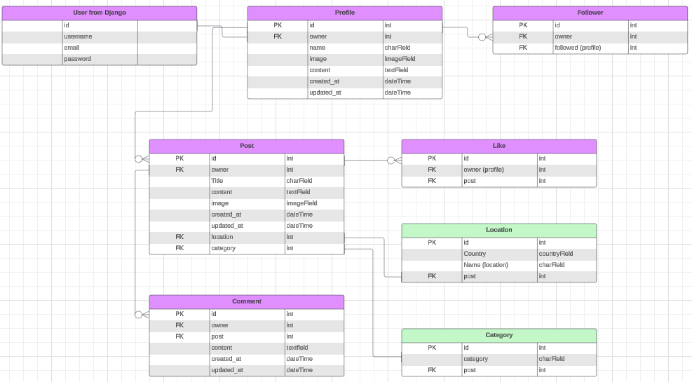

# EnergyPlace API: Backend Documentation

This document details the architecture and functionality of the EnergyPlace API, a Django REST Framework (DRF) based backend providing services for the EnergyPlace frontend application.

View the live [EnergyPlace App](https://energyplace-fe-44789d1db942.herokuapp.com/)
 application.

## Table of Contents

- [Introduction](#introduction)
- [Agile Methodologies](#agile-methodologies)
  - [Kanban Board](#kanban-board)
  - [Epics](#epics)
  - [User Stories](#user-stories)
- [Technologies Used](#technologies-used)
- [Database Design](#database-design)
- [API Models](#api-models)
  - [User](#user)
  - [Profile](#profile)
  - [Post](#post)
  - [Location](#location)
  - [Category](#category)
  - [Comment](#comment)
  - [Like](#like)
  - [Follower](#follower)
- [API Endpoints](#api-endpoints)
  - [Authentication Endpoints](#authentication-endpoints)
  - [Profile Endpoints](#profile-endpoints)
  - [Post Endpoints](#post-endpoints)
  - [Comment Endpoints](#comment-endpoints)
  - [Like Endpoints](#like-endpoints)
  - [Follower Endpoints](#follower-endpoints)
  - [Location Endpoints](#location-endpoints)
  - [Category Endpoints](#category-endpoints)
- [Authentication](#authentication)
- [Testing](#testing)
- [Deployment](#deployment)
    - [GitHub](#github)
    - [Heroku Deployment](#heroku-deployment)
- [Project Setup](#project-setup)
- [Security](#security)
- [Credits](#credits)

## Introduction

The EnergyPlace API serves as the backend for a social platform where users can share and discover inspiring locations. It manages user accounts, posts, comments, likes, and follow relationships, providing a robust and scalable infrastructure for the frontend application.

## Agile Methodologies

Agile methodologies are used in this project to support iterative development and continuous improvement. By working in small, manageable increments and regularly reassessing priorities, Agile allows for flexibility and faster delivery of features. This approach also enables the integration of evolving requirements and feedback throughout the project, accommodating changes effectively

### Kanban board

The Kanban board is used in this project to visualize and manage tasks. By organizing work into columns representing different stages (e.g., To Do, In Progress, Done), the Kanban board helps track progress and prioritize tasks efficiently.

View the [board](https://github.com/users/Malinchristina/projects/7) for this project.

### Epics

### User stories

## Technologies Used

* **Programming Language:** Python  
* **Framework:** Django 4.2, Django REST Framework (DRF)  
* **Database:** PostgreSQL (for production), SQLite (for development)  
* **Authentication:** JSON Web Tokens (JWT) provided by `djangorestframework-simplejwt`, with pre-built endpoints from `dj-rest-auth` and `allauth`  
* **Image Storage:** Cloudinary, integrated via `django-cloudinary-storage`  
* **Additional Libraries:**
  - `django-countries` for handling country fields  
  - `django-filter` for filtering data in APIs  
  - `gunicorn` as the WSGI HTTP server for deployment  

## Database Design

The database schema for the application is illustrated using an Entity Relationship Diagram (ERD). [Lucidchart](https://www.lucidchart.com/) was used to design the ERD, providing a clear visual representation of the database structure. This diagram outlines the relationships between different entities in the project, ensuring efficient data organization and retrieval. The ERD served as a crucial tool in planning the database and outline the models.

  
Click to view ERD

  
  

 

## API Models

The database models define the structure and relationships of the data stored in the API. Below is an overview of each model:

  
User

  The `User` model is provided by Django and serves as the foundation for user authentication. It includes fields like `username`, `email`, and `password`. This model is extended via the `Profile` model for additional user details.

  
Profile

  The `Profile` model extends the `User` model with additional fields:
  - **`owner`**: A foreign key to the `User` model.
  - **`name`**: A custom name for the profile.
  - **`image`**: A profile picture.
  - **`content`**: A bio or description.
  - **Timestamps**: Tracks `created_at` and `updated_at`.

  
Post

  The `Post` model represents a user-generated post and includes:
  - **`owner`**: The user who created the post.
  - **`title`**: The title of the post.
  - **`content`**: The main text content of the post.
  - **`image`**: An optional image attached to the post.
  - **`location`**: A foreign key to the `Location` model, representing where the post is about.
  - **`locality`**: A specific place within the location, such as a city or village.
  - **`category`**: A foreign key to the `Category` model for classifying the post.
  - **Timestamps**: Tracks `created_at` and `updated_at`.

  
Location

  The `Location` model stores geographic information:
  - **`country`**: A country field (e.g., "SE" for Sweden).

  
Category

  The `Category` model defines predefined categories for posts:
  - **`name`**: The name of the category (e.g., "nature", "sports").
  - Categories are predefined and enforced through choices.

  
Comment

  The `Comment` model represents comments on posts:
  - **`owner`**: The user who made the comment.
  - **`post`**: The post that the comment is associated with.
  - **`content`**: The text content of the comment.
  - **Timestamps**: Tracks `created_at` and `updated_at`.

  
Like

  The `Like` model represents likes on posts:
  - **`owner`**: The user who liked the post.
  - **`post`**: The post that was liked.
  - **`created_at`**: Tracks when the like was made.

  
Follower

  The `Follower` model tracks relationships between users:
  - **`owner`**: The user who is following someone.
  - **`followed`**: The user being followed.
  - **`created_at`**: Tracks when the follow action was made.

## API Endpoints

  
Authentication Endpoints

  - **POST** `/dj-rest-auth/login/`: User login.
  - **POST** `/dj-rest-auth/logout/`: User logout.
  - **POST** `/dj-rest-auth/registration/`: User registration.
  - **POST** `/dj-rest-auth/password/change/`: Password change.
  - **GET** `/dj-rest-auth/user/`: Retrieve current user data.

  
Profile Endpoints

  - **GET** `/profiles/`: List all profiles (supports filtering and searching).
  - **GET, PUT (owner only)** `/profiles/<int:pk>/`: Retrieve or update a profile.

  
Post Endpoints

  - **GET, POST** `/posts/`: List all posts (supports filtering, searching, ordering) or create a post.
  - **GET, PUT, DELETE (owner only)** `/posts/<int:pk>/`: Retrieve, update, or delete a specific post.

  
Comment Endpoints

  - **GET, POST** `/comments/`: List all comments for a post or create a new comment.
  - **GET, PUT, DELETE (owner only)** `/comments/<int:pk>/`: Retrieve, update, or delete a specific comment.

  
Like Endpoints

  - **POST** `/likes/`: Create a new like.
  - **DELETE** `/likes/<int:pk>/`: Remove a like.

  
Follower Endpoints

  - **POST** `/followers/`: Create a follower relationship.
  - **DELETE** `/followers/<int:pk>/`: Remove a follower relationship.

  
Location Endpoints

  - **GET** `/locations/`: List all locations (filterable by country).
  - **GET, PUT** `/locations/<int:pk>/`: Retrieve or update a specific location.
  - **GET** `/locations/full-countries/`: Retrieve the full list of countries with unique IDs.
  - **GET** `/locations/countries/`: List countries with associated posts.

  
Category Endpoints

  - **GET** `/categories/`: List all categories.
  - **GET** `/categories/<int:pk>/`: Retrieve a specific category.

## Authentication

The API uses **JSON Web Tokens (JWT)** for authentication, managed through `dj-rest-auth` and `allauth`. JWT cookies are used to maintain secure sessions.

## Testing

### ADD

## Deployment

### GitHub
The repository was created and stored on GitHub. Any changes made in VS Code was done with the commands.

* git add .
* git commit -m "Commit message"
* git push

### Heroku Deployment

The application is deployed to Heroku using a `Procfile` that specifies `gunicorn` for the web server.   The `release` command in the `Procfile` ensures that migrations are run on deployment.

The steps to deploy in Heroku:

1. Log in to Heroku
2. Create new app
3. In settings, press Reveal Config Vars and add relevant config vars.  
   

     
Configuration Variables

     

   

 

4. Scroll down to add buildpack heroku/python
5. In Deploy connect to GitHub and find the repository
6. Scroll down and connect, in this case, manually on Deploy Branch.
7. Click open app to view the deployed app

## Project Setup

To set up the project for development, follow these steps:

1. Clone the repository to VS Code.
2. Create a virtual environment and activate it.
3. Install the project dependencies listed in `requirements.txt`.
4. Configure environment variables by creating a `.env` file in the project root.
5. Apply database migrations to set up the database schema.
6. Create a superuser to access the Django admin panel.
7. Start the development server and access the application in the browser.

### Prerequisites
- Python
- pip (Python package manager)
- PostgreSQL (for production)
- A Cloudinary account (for image storage)

## Security

The API follows these security best practices:
- All sensitive data (e.g., `SECRET_KEY`, database credentials) is stored in environment variables.
- Authentication is managed with JSON Web Tokens (JWT) for secure session handling.

## Credits

- **Inspiration:**
  - A lot of inspiration comes from Code Institutes Moments walkthrough project.

- **How to**
  - Better understand country_field: 
[CountryField](https://stackoverflow.com/questions/70850703/how-to-serialize-a-countryfield-from-django-countries).
- The project involved extensive research, trial and error, and reading resources from websites such as [W3schools](https://www.w3schools.com/), [MDN webdocs](https://developer.mozilla.org/en-US/), [Geeks for Geeks](https://www.geeksforgeeks.org/) and [Stack Overflow](https://stackoverflow.com/).

- **Frameworks and Tools:**
  - [Django REST Framework Documentation](https://www.django-rest-framework.org/)
  - [Cloudinary](https://cloudinary.com/documentation)

[Back to top](#top)