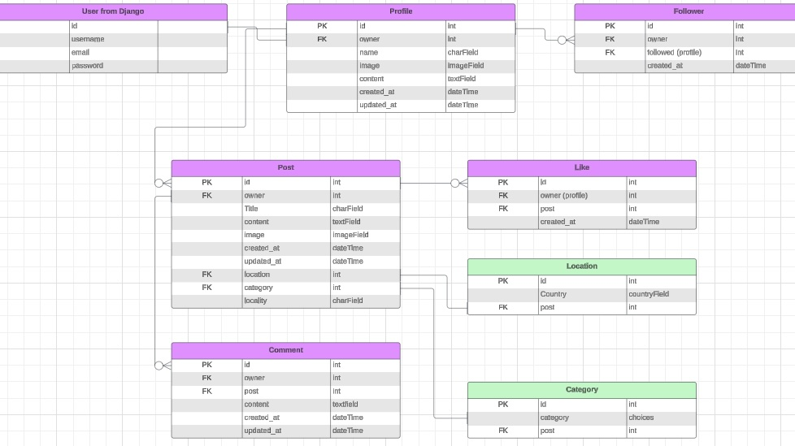
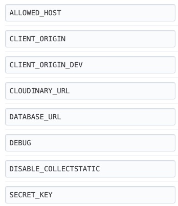

# EnergyPlace API: Backend Documentation

This document details the architecture and functionality of the EnergyPlace API, a Django REST Framework (DRF) based backend providing services for the EnergyPlace frontend application.

View the live [EnergyPlace](https://energyplace-fe-44789d1db942.herokuapp.com/)
 application.

## Table of Contents

- [EnergyPlace API: Backend Documentation](#energyplace-api-backend-documentation)
- [Agile Methodologies](#agile-methodologies)
- [Technologies Used](#technologies-used)
- [Database Design](#database-design)
- [API Models](#api-models)
  - [User](#user)
  - [Profile](#profile)
  - [Post](#post)
  - [Location](#location)
  - [Category](#category)
  - [Comment](#comment)
  - [Like](#like)
  - [Follower](#follower)
- [API Endpoints](#api-endpoints)
  - [Authentication Endpoints](#authentication-endpoints)
  - [Profile Endpoints](#profile-endpoints)
  - [Post Endpoints](#post-endpoints)
  - [Comment Endpoints](#comment-endpoints)
  - [Like Endpoints](#like-endpoints)
  - [Follower Endpoints](#follower-endpoints)
  - [Location Endpoints](#location-endpoints)
  - [Category Endpoints](#category-endpoints)
- [Authentication](#authentication)
- [Testing](#testing)
  - [Validation](#validation)
- [Deployment](#deployment)
    - [GitHub](#github)
    - [Heroku Deployment](#heroku-deployment)
- [Project Setup](#project-setup)
- [Security](#security)
- [Credits](#credits)
  - [Tools & Programs](#tools-and-programs)
  - [Inspiration](#inspiration)
  - [How to](#how-to)
  - [Acknowledgments](#acknowledgements)

## Introduction

The EnergyPlace API serves as the backend for a social platform where users can share and discover inspiring locations. It manages user accounts, posts, comments, likes, and follow relationships, providing a robust and scalable infrastructure for the frontend application.

## Agile Methodologies

An Agile workflow, managed using a [Kanban board](https://github.com/users/Malinchristina/projects/7), guided this project's iterative development. While [MoSCoW prioritization](https://en.wikipedia.org/wiki/MoSCoW_method) wasn't formally tracked on the Kanban board itself, this method was applied mentally throughout the user story development and task assignment process, with the following categorization:

- **Must have:** User authentication, Post creation, Post display.
- **Should have:** Commenting functionality, Liking functionality.
- **Could have:** Advanced search filters, User profiles.
- **Won't have (in this iteration):** Notifications, Map integration, FollowersList

Larger features were structured as epics, further decomposed into individual user stories for effective task management and progress tracking.

## Technologies Used

* **Programming Language:** Python  
* **Framework:** Django 4.2, Django REST Framework (DRF)  
* **Database:** PostgreSQL (for production), SQLite (for development)  
* **Authentication:** JSON Web Tokens (JWT) provided by `djangorestframework-simplejwt`, with pre-built endpoints from `dj-rest-auth` and `allauth`  
* **Image Storage:** Cloudinary, integrated via `django-cloudinary-storage`  
* **Additional Libraries:**
  - `django-countries` for handling country fields  
  - `django-filter` for filtering data in APIs  
  - `gunicorn` as the WSGI HTTP server for deployment  

## Database Design

The database schema for the application is illustrated using an Entity Relationship Diagram (ERD). [Lucidchart](https://www.lucidchart.com/) was used to design the ERD, providing a clear visual representation of the database structure. This diagram outlines the relationships between different entities in the project, ensuring efficient data organization and retrieval. The ERD served as a crucial tool in planning the database and outline the models.

  
Click to view ERD

  
  

 

## API Models

The database models define the structure and relationships of the data stored in the API. Below is an overview of each model:

  
User

  The `User` model is provided by Django and serves as the foundation for user authentication. It includes fields like `username`, `email`, and `password`. This model is extended via the `Profile` model for additional user details.

  
Profile

  The `Profile` model extends the `User` model with additional fields:
  - **`owner`**: A foreign key to the `User` model.
  - **`name`**: A custom name for the profile.
  - **`image`**: A profile picture.
  - **`content`**: A bio or description.
  - **Timestamps**: Tracks `created_at` and `updated_at`.

  
Post

  The `Post` model represents a user-generated post and includes:
  - **`owner`**: The user who created the post.
  - **`title`**: The title of the post.
  - **`content`**: The main text content of the post.
  - **`image`**: An optional image attached to the post.
  - **`location`**: A foreign key to the `Location` model, representing where the post is about.
  - **`locality`**: A specific place within the location, such as a city or village.
  - **`category`**: A foreign key to the `Category` model for classifying the post.
  - **Timestamps**: Tracks `created_at` and `updated_at`.

  
Location

  The `Location` model stores geographic information:
  - **`country`**: A country field (e.g., "SE" for Sweden).

  
Category

  The `Category` model defines predefined categories for posts:
  - **`name`**: The name of the category (e.g., "nature", "sports").
  - Categories are predefined and enforced through choices.

  
Comment

  The `Comment` model represents comments on posts:
  - **`owner`**: The user who made the comment.
  - **`post`**: The post that the comment is associated with.
  - **`content`**: The text content of the comment.
  - **Timestamps**: Tracks `created_at` and `updated_at`.

  
Like

  The `Like` model represents likes on posts:
  - **`owner`**: The user who liked the post.
  - **`post`**: The post that was liked.
  - **`created_at`**: Tracks when the like was made.

  
Follower

  The `Follower` model tracks relationships between users:
  - **`owner`**: The user who is following someone.
  - **`followed`**: The user being followed.
  - **`created_at`**: Tracks when the follow action was made.

## API Endpoints

  
Authentication Endpoints

  - **POST** `/dj-rest-auth/login/`: User login.
  - **POST** `/dj-rest-auth/logout/`: User logout.
  - **POST** `/dj-rest-auth/registration/`: User registration.
  - **POST** `/dj-rest-auth/password/change/`: Password change.
  - **GET** `/dj-rest-auth/user/`: Retrieve current user data.

  
Profile Endpoints

  - **GET** `/profiles/`: List all profiles (supports filtering and searching).
  - **GET, PUT (owner only)** `/profiles/<int:pk>/`: Retrieve or update a profile.

  
Post Endpoints

  - **GET, POST** `/posts/`: List all posts (supports filtering, searching, ordering) or create a post.
  - **GET, PUT, DELETE (owner only)** `/posts/<int:pk>/`: Retrieve, update, or delete a specific post.

  
Comment Endpoints

  - **GET, POST** `/comments/`: List all comments for a post or create a new comment.
  - **GET, PUT, DELETE (owner only)** `/comments/<int:pk>/`: Retrieve, update, or delete a specific comment.

  
Like Endpoints

  - **POST** `/likes/`: Create a new like.
  - **DELETE** `/likes/<int:pk>/`: Remove a like.

  
Follower Endpoints

  - **POST** `/followers/`: Create a follower relationship.
  - **DELETE** `/followers/<int:pk>/`: Remove a follower relationship.

  
Location Endpoints

  - **GET** `/locations/`: List all locations (filterable by country).
  - **GET, PUT** `/locations/<int:pk>/`: Retrieve or update a specific location.
  - **GET** `/locations/full-countries/`: Retrieve the full list of countries with unique IDs.
  - **GET** `/locations/countries/`: List countries with associated posts.

  
Category Endpoints

  - **GET** `/categories/`: List all categories.
  - **GET** `/categories/<int:pk>/`: Retrieve a specific category.

## Authentication

The API uses **JSON Web Tokens (JWT)** for authentication, managed through `dj-rest-auth` and `allauth`. JWT cookies are used to maintain secure sessions.

## Testing

### Epics & User Stories

  
User Management API

  [GitHub Issue Link](https://github.com/Malinchristina/EnergyPlace-API/issues/1)

| TC ID   | US # | Title            | Pass as expected |
|---------|------|------------------|------------------|
| EPIC #1 |      |                  |                  |
| TC1     | 7    | Create superuser | Yes              |
| TC2     | 8    | Log in view      | Yes              |
| TC3     | 36   | Log out view     | Yes              |

  
Profile API

  [GitHub Issue Link](https://github.com/Malinchristina/EnergyPlace-API/issues/35)

| TC ID    | US # | Title                  | Pass as expected |
|----------|------|------------------------|------------------|
| EPIC #35 |      |                        |                  |
| TC4      | 31   | Detailed profile view  | Yes              |
| TC5      | 32   | Edit profile           | Yes              |
| TC6      | 33   | Change profile picture | Yes              |

  
Post API

  [GitHub Issue Link](https://github.com/Malinchristina/EnergyPlace-API/issues/2)

| TC ID   | US # | Title                  | Pass as expected |
|---------|------|------------------------|------------------|
| EPIC #2 |      |                        |                  |
| TC7     | 10   | Create post            | Yes              |
| TC8     | 11   | Edit & delete posts    | Yes              |
| TC9     | 12   | View postlist          | Yes              |
| TC10    | 16   | Add location to post   | Yes              |
| TC11    | 18   | Add category to post   | Yes              |
| TC12    | 46   | Location detail view   | Yes              |
| TC13    | 48   | Category detailed view | Yes              |
| TC14    | 49   | View Likes on Posts    | Yes              |

  
Follower Interaction API

  [GitHub Issue Link](https://github.com/Malinchristina/EnergyPlace-API/issues/3)

| TC ID   | US # | Title                      | Pass as expected |
|---------|------|----------------------------|------------------|
| EPIC #3 |      |                            |                  |
| TC15    | 13   | Follow user                | Yes              |
| TC16    | 14   | Unfollow user              | Yes              |
| TC17    | 15   | View profile list          | Yes              |
| TC18    | 50   | View followers on profiles | Yes              |

  
Location API

  [GitHub Issue Link](https://github.com/Malinchristina/EnergyPlace-API/issues/4)

| TC ID   | US # | Title              | Pass as expected |
|---------|------|--------------------|------------------|
| EPIC #4 |      |                    |                  |
| TC19    | 17   | Filter by location | Yes              |
| TC20    | 45   | Location list      | Yes              |

  
Category API

  [GitHub Issue Link](https://github.com/Malinchristina/EnergyPlace-API/issues/5)

| TC ID   | US # | Title              | Pass as expected |
|---------|------|--------------------|------------------|
| EPIC #5 |      |                    |                  |
| TC21    | 19   | Filter by category | Yes              |
| TC22    | 47   | Category list view | Yes              |

  
Comment API

  [GitHub Issue Link](https://github.com/Malinchristina/EnergyPlace-API/issues/21)

| TC ID    | US # | Title                   | Pass as expected |
|----------|------|-------------------------|------------------|
| EPIC #21 |      |                         |                  |
| TC23     | 22   | Add comment on a post   | Yes              |
| TC24     | 23   | Edit comments           | Yes              |
| TC25     | 24   | Delete comments         | Yes              |
| TC26     | 25   | View comments on a post | Yes              |

  
Like API

  [GitHub Issue Link](https://github.com/Malinchristina/EnergyPlace-API/issues/30)

| TC ID    | US # | Title       | Pass as expected |
|----------|------|-------------|------------------|
| EPIC #30 |      |             |                  |
| TC27     | 26   | Likelist    | Yes              |
| TC28     | 27   | Unlike post | Yes              |

### Validation

To ensure the backend code adheres to PEP8 standards, the project was validated using [Code Institute's CI Python Linter](https://pep8ci.herokuapp.com/). This tool checks Python code for compliance with PEP8, the official style guide for Python.

All Python files now pass PEP8 validation with no errors or warnings.

## Deployment

### GitHub
The repository was created and stored on GitHub. Any changes made in VS Code was done with the commands.

* git add .
* git commit -m "Commit message"
* git push

### Heroku Deployment

The application is deployed to Heroku using a `Procfile` that specifies `gunicorn` for the web server.   The `release` command in the `Procfile` ensures that migrations are run on deployment.

The steps to deploy in Heroku:

1. Log in to Heroku
2. Create new app
3. In settings, press Reveal Config Vars and add relevant config vars.  
   

     
Configuration Variables

     

   

 

4. Scroll down to add buildpack heroku/python
5. In Deploy connect to GitHub and find the repository
6. Scroll down and connect, in this case, manually on Deploy Branch.
7. Click open app to view the deployed app

## Project Setup

To set up the project for development, follow these steps:

1. Clone the repository to VS Code.
2. Create a virtual environment and activate it.
3. Install the project dependencies listed in `requirements.txt`.
4. Configure environment variables by creating a `.env` file in the project root.
5. Apply database migrations to set up the database schema.
6. Create a superuser to access the Django admin panel.
7. Start the development server and access the application in the browser.

### Prerequisites
- Python
- pip (Python package manager)
- PostgreSQL (for production)
- A Cloudinary account (for image storage)

## Security

The API follows these security best practices:
- All sensitive data (e.g., `SECRET_KEY`, database credentials) is stored in environment variables.
- Authentication is managed with JSON Web Tokens (JWT) for secure session handling.

## Credits

### Tools & Programs

- **Lucidchart:** Utilized to design the Entity-Relationship Diagram (ERD), offering a clear visualization of the database schema and the relationships between models.
- **Git:** Employed for version control to track code changes and maintain the history of the project.
- **GitHub:** Used as the repository hosting platform, enabling collaboration and tracking development progress.
- **Heroku:** A cloud-based platform for deploying and hosting the application, ensuring smooth operation and accessibility.
- **PostgreSQL:** The database system integrated into the application, managed through Heroku for scalability and reliability.
- **Cloudinary:** Serves as the platform for media storage, handling image hosting and delivery efficiently.

### Inspiration
- A lot of inspiration comes from Code Institutes Moments walkthrough project.

### How to
- Better understand country_field: 
[CountryField](https://stackoverflow.com/questions/70850703/how-to-serialize-a-countryfield-from-django-countries).
- The project involved extensive research, trial and error, and reading resources from websites such as [W3schools](https://www.w3schools.com/), [MDN webdocs](https://developer.mozilla.org/en-US/), [Geeks for Geeks](https://www.geeksforgeeks.org/) and [Stack Overflow](https://stackoverflow.com/).

### Frameworks
- [Django REST Framework Documentation](https://www.django-rest-framework.org/)

### Acknowledgments
- My mentor Gareth McGirr for support and guidance.
- Thanks to the swedish community in Slack for support and testing.

[Back to top](#top)